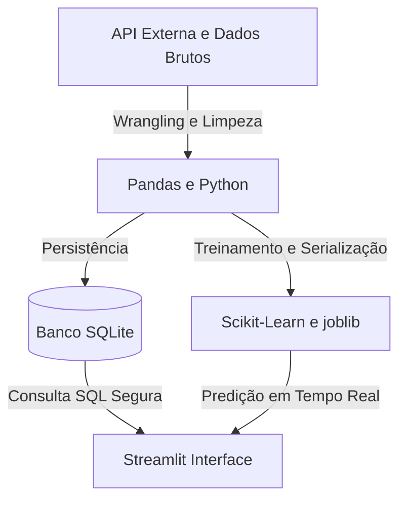

# 💰 Fintech Acadêmica - Sistema Full-Stack de Gestão e Predição Financeira

[](https://github.com/alunosilaspo/analise-software-dados)
[](https://www.python.org/)
[](https://semana2010-h7zh6utrdphuwzznb6q688.streamlit.app)
[](https://opensource.org/licenses/MIT)

> Um ecossistema completo de engenharia e ciência de dados desenvolvido para auxiliar estudantes universitários no controle orçamentário e na predição inteligente de despesas futuras.

---

## 🎯 Sobre o Problema e Objetivo
A gestão financeira pessoal é um desafio recorrente na vida acadêmica. O projeto **Fintech Acadêmica** resolve essa dor ao centralizar o histórico de transações, limpar inconsistências de dados e disponibilizar um painel interativo aliado a um modelo de Machine Learning preditivo. 

O objetivo principal é transformar dados brutos e públicos em *insights* acionáveis e estimativas precisas de gastos futuros.

---

## 🏗️ Arquitetura e Fluxo de Dados
O projeto segue uma arquitetura modular inspirada nas melhores práticas de desenvolvimento de software (*Clean Code*, *Type Hinting* e tratamento de exceções):



⚙️ Tecnologias Utilizadas
Linguagem: Python 3.10+

Engenharia de Dados & Wrangling: Pandas, NumPy, SQLite

Machine Learning: Scikit-Learn (Regressão Linear, One-Hot Encoding, Métricas MAE), Joblib

Interface Web & Visualização: Streamlit, Seaborn, Matplotlib

Deploy & Versionamento: Git, GitHub, Streamlit Community Cloud

## 📂 Estrutura do Repositório
```text
analise-software-dados/
│
├── imagens/
│   └── dashboard_executivo.png     # Screenshots do painel
├── Semana 9/
│   └── modelo_despesas.joblib      # Artefato de Machine Learning treinado
├── Semana 10/
│   ├── app.py                      # Aplicação principal (Streamlit)
│   ├── database.py                 # Camada de conexão e consultas SQL
│   ├── models.py                   # Lógica de inferência e predição
│   └── requirements.txt            # Dependências fixas do projeto
├── fintech_integrada.db            # Base de dados relacional consolidada
└── README.md                       # Documentação técnica do projeto

🚀 Como Executar o Projeto Localmente
Siga os passos abaixo para clonar e rodar a aplicação na sua máquina:

Clone o repositório:

Bash
git clone [https://github.com/alunosilaspo/analise-software-dados.git](https://github.com/alunosilaspo/analise-software-dados.git)
cd analise-software-dados
Entre na pasta da aplicação:

Bash
cd "Semana 10"
Instale as dependências:

Bash
pip install -r requirements.txt
Execute o aplicativo Streamlit:

Bash
streamlit run app.py
📊 Demonstração Funcional
Painel Executivo: Gráficos dinâmicos segmentados por categorias de despesa, métricas de soma total e ticket médio por lançamento.

Simulador Preditivo: Interface interativa onde o usuário insere a sua média histórica de gastos para estimar o valor da próxima despesa com base no modelo de Machine Learning integrado.

🌐 **Acesse o aplicativo online:** https://semana2010-h7zh6utrdphuwzznb6q688.streamlit.app

👤 Autor
Desenvolvido por Silas

Estudante de Matemática